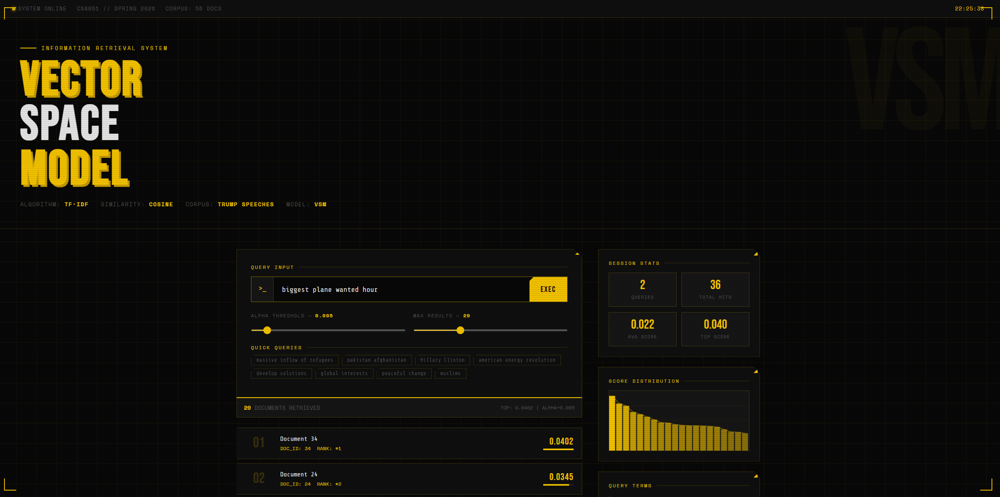

# Vector Space Model (VSM) Information Retrieval System



## Overview
This system is a full-stack search engine implementation designed to retrieve and rank documents from a corpus of Trump Speeches. It utilizes the Vector Space Model framework, converting text into high-dimensional vectors to calculate document relevance based on mathematical similarity rather than simple keyword matching.

The project was developed for the CS4051 Information Retrieval course, Spring 2026.

---

## Technical Specifications
* **Retrieval Model:** Vector Space Model (VSM) using Cosine Similarity.
* **Term Weighting:** TF-IDF (Term Frequency-Inverse Document Frequency).
* **Text Processing:** Tokenization, Case Folding, Stopword Removal, and Porter Stemming.
* **Performance:** Persistent indexing via serialized Pickle files to minimize runtime overhead.
* **Interface:** Interactive dashboard with real-time similarity thresholding and weight analysis.

---

## System Architecture

### Text Preprocessing
The `preprocessing.py` module handles the linguistic normalization pipeline:
* Removal of non-alphabetic characters and punctuation.
* Filtering of high-frequency, low-info terms using a custom Stopword list.
* Word reduction to base forms via the NLTK Porter Stemmer.

### Indexing and Storage
The `indexer.py` script processes the corpus to generate the global vocabulary and document-term matrix. These structures are saved to the `/index` directory to allow the application to boot instantly without re-processing the raw text files.

### Retrieval Logic
The `vsm_retrieval.py` engine performs the core linear algebra. It converts user input into a query vector and calculates the Cosine Similarity against all document vectors:

$$Similarity = \frac{A \cdot B}{||A|| \cdot ||B||}$$

### Web Backend
`app.py` serves as the Flask controller, managing the API routes between the frontend dashboard and the Python retrieval logic.

---

## Installation and Setup

### Dependencies
* Python 3.x
* Flask
* NLTK

### Execution

1. **Clone the repository:**
```bash
   git clone https://github.com/ibad-ur-rehman-9/Vector_Space_Model.git
```

2. **Install required packages:**
```bash
   pip install flask nltk
```

3. **Generate the search index:**
```bash
   python indexer.py
```

4. **Launch the server:**
```bash
   python app.py
```

5. **View the Dashboard:** Navigate to `http://127.0.0.1:5000` in any web browser.

---

## 📁 Directory Structure

```
/corpus             # Source text documents
/index              # Pre-computed TF-IDF matrices and vocabulary
/templates          # HTML/CSS/JS source for the dashboard
app.py              # Main Flask application
preprocessing.py    # NLP cleaning functions
vsm_retrieval.py    # Vector math engine
```
